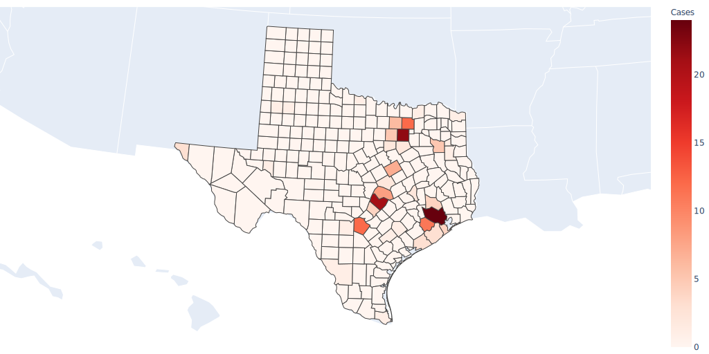

# Texas Covid-19 Tracker by County
#### Author: Dawson Fields
---

## Description:
A python project to track all known cases of Covid-19 (Coronavirus) in Texas by county. To view each county more accurately please [click here](https://dfields16.github.io/Texas_Covid19_Tracker/).

## Inspiration:
 I wanted a way to easily visualize the spread of Covid-19 in the state of Texas to better understand the situation. Viewing sites such as [John Hopkins Coronavirus Tracker](https://www.arcgis.com/apps/opsdashboard/index.html#/bda7594740fd40299423467b48e9ecf6) caused me to want to know more about the spread in my own state. Since most sites did not have county level accuracy, I decided to make my own. I was able to find data here: [DSHS Texas](https://dshs.texas.gov/news/updates.shtm#coronavirus). The only issue was, how should I go about creating this?
 I chose python because I have not used python very frequently and I wanted to sharpen my skills in it. After doing some research, I was able to write a prototype script in about two hours.

## Data Sources:
- [https://dshs.texas.gov/news/updates.shtm#coronavirus](https://dshs.texas.gov/news/updates.shtm#coronavirus)
